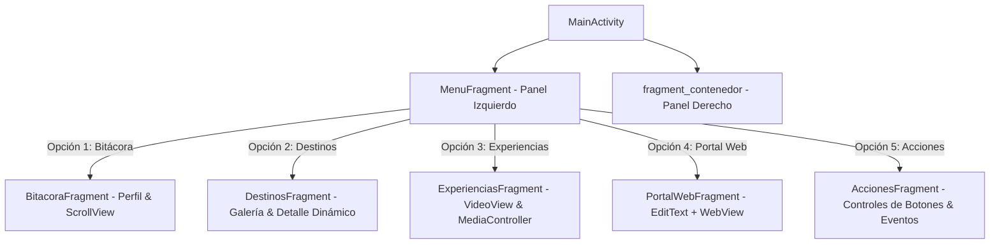

# NativeSquad - Guía de Viajes Turísticos (HPM) ✈️🇨🇴

Aplicación móvil nativa para el sistema operativo **Android** desarrollada para el módulo de **Herramientas de Programación Móvil I** de la **Institución Universitaria Politécnico Grancolombiano**.

---

## 👥 Equipo de Trabajo (NativeSquad HPM)

* **Sandra Milena Millan Alvarez**
* **Miguel Angel Mendoza Niño**
* **Juan José Muñoz Valencia**
* **Julio Ernesto Murillo Cocunubo**

**Tutor:** Víctor Fabián Castro Pérez  
**Facultad:** Facultad de Ingeniería, Diseño e Innovación  
**Repositorio Oficial:** [https://github.com/MiguelAngel-Mendoza/NativeSquad](https://github.com/MiguelAngel-Mendoza/NativeSquad)

---

## 📱 Arquitectura de la Aplicación

La aplicación implementa una arquitectura modular basada en **pantalla dividida horizontalmente** con dos secciones principales sincronizadas en tiempo real:

1. **Panel Izquierdo Fijo (`MenuFragment`)**:
   * Menú vertical permanente con 5 accesos directos tematizados.
   * Resaltado visual del elemento activo con micro-interacciones.
2. **Panel Derecho Dinámico (`FrameLayout` / `fragment_contenedor`)**:
   * Contenedor que muta su contenido mediante `FragmentTransaction` y `FragmentManager` con animaciones de transición fluidas sin recargar la actividad principal.



---

## 🚀 Módulos Funcionales (Trazabilidad con Rúbrica)

| Opción de Menú | Submódulo Android | Componentes Clave | Requerimiento / Rubro |
| :--- | :--- | :--- | :--- |
| **Bitácora** | `BitacoraFragment` | `ScrollView`, `CardView`, `TextView` | **RF-02 / Perfil:** Muestra información institucional, equipo de trabajo, estadísticas de rutas y recomendaciones con scroll vertical. |
| **Destinos** | `DestinosFragment` | `RecyclerView`, `ImageView`, `CardView` | **RF-03 / Fotos:** Galería fotográfica de locaciones (Cartagena, Eje Cafetero, Tayrona, etc.) con actualización dinámica de reseña histórica y geográfica al pulsar. |
| **Experiencias** | `ExperienciasFragment` | `VideoView`, `MediaController`, `ProgressBar` | **RF-04 / Video:** Reproductor de video nativo con controles táctiles (Play, Pausa, Replay) y selector de clips HD. |
| **Portal Web** | `PortalWebFragment` | `EditText`, `MaterialButton`, `WebView` | **RF-05 / Web:** Navegador interno con barra de URL, marcadores de acceso rápido y visualización web embebida. |
| **Acciones** | `AccionesFragment` | `MaterialButton`, `RadioGroup`, `AlertDialog` | **RF-06 / Botones:** Demostración de botones avanzados: contador de itinerario, toggle de favoritos, calculadora de presupuesto y línea de auxilio SOS. |

---

## 🛠️ Stack Tecnológico

* **Plataforma:** Android Nativo
* **Lenguaje de Programación:** Java (JDK 17)
* **SDK Compilación (Target SDK):** 34 (Android 14)
* **SDK Mínimo (Min SDK):** 24 (Android 7.0 Nougat)
* **Diseño UI:** AndroidX, Google Material Design Components 3, LinearLayout, ConstraintLayout y CardView
* **Gestor de Construcción:** Gradle 8.2 & Android Gradle Plugin 8.2.2

---

## 📂 Estructura del Código Fuente

```text
Herramientas-Programacion/
├── app/
│   ├── src/
│   │   ├── main/
│   │   │   ├── AndroidManifest.xml
│   │   │   ├── java/com/nativesquad/guiadeviajes/
│   │   │   │   ├── MainActivity.java
│   │   │   │   ├── adapters/
│   │   │   │   │   └── DestinosAdapter.java
│   │   │   │   ├── fragments/
│   │   │   │   │   ├── MenuFragment.java
│   │   │   │   │   ├── BitacoraFragment.java
│   │   │   │   │   ├── DestinosFragment.java
│   │   │   │   │   ├── ExperienciasFragment.java
│   │   │   │   │   ├── PortalWebFragment.java
│   │   │   │   │   └── AccionesFragment.java
│   │   │   │   └── models/
│   │   │   │       ├── Destino.java
│   │   │   │       └── DestinosData.java
│   │   │   └── res/
│   │   │       ├── anim/ (transiciones fade y slide)
│   │   │       ├── drawable/ (vectores gráficos de destinos e iconos)
│   │   │       ├── layout/ (layouts XML de actividades y fragmentos)
│   │   │       └── values/ (colores temáticos de turismo, cadenas, estilos)
│   └── build.gradle
├── gradle/wrapper/
├── build.gradle
├── gradle.properties
├── settings.gradle
└── README.md
```

---

## 💻 Instrucciones de Compilación y Ejecución

### Desde Android Studio:
1. Abrir Android Studio y seleccionar **Open...**
2. Elegir la carpeta raíz `Herramientas-Programacion`.
3. Esperar la sincronización de Gradle (*Sync Project with Gradle Files*).
4. Seleccionar un emulador o dispositivo físico y presionar **Run 'app'** (`Shift + F10`).

### Desde Terminal:
```bash
# Compilar el APK en modo Debug
./gradlew assembleDebug

# El APK generado se ubicará en:
# app/build/outputs/apk/debug/app-debug.apk
```
